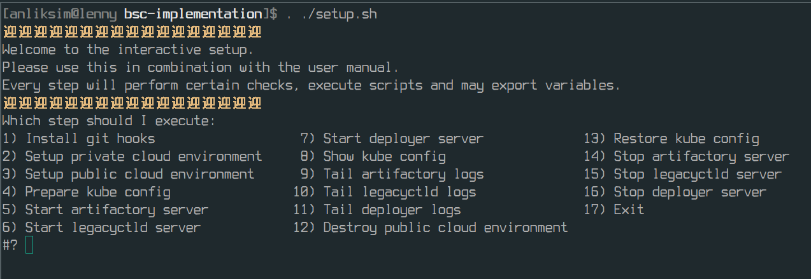

# User manual

> Note: this manual has been created for the original submission content. The open soruced version is slightly different in structure and needs minor adjustments. The tooling an binaries are part of the tooling repository.

Everything is designed for and tested with linux (Arch 18.1.0 and 20.0.1).
If another system or system architecture is used, the binaries (bsc-deployer, legacyctl, legadyctld) have to be rebuilt using the required [GOOS and GOARCH](https://gist.github.com/asukakenji/f15ba7e588ac42795f421b48b8aede63).

Software that is a prerequisite for the setup to work (will be mentioned again when needed):
* HashiCorp Terraform
* Java Runtime Environment (JRE)
* Virtualization driver (i.e. KVM)
* Public cloud account (i.e. Microsoft Azure)

There is an interactive guided setup script. Make sure to run it as outlined below to allow env variables to be exported into the env of the calling shell process (in the bsc-implementation directory).

```
. ./setup.sh
```




## 1. Hooks

The bsc-env repository contains all env and app setups.
To allow to use this POC locally there is a post-commit hook.

Run step `1) Install git hooks` of the script to install the hook.

The output will show something along the lines of:
```
Installed:
.git/modules/bsc-env/hooks/post-commit
```
Due to the use of submodules it is installed into the modules folder. Alternatively, the location if used with a direct checkout of bsc-env would be `.git/hooks/post-commit`.

## 2. Private cloud

Minikube is used for the private cloud environment. Follow the [official documentation](https://kubernetes.io/docs/tasks/tools/install-minikube/) on how to install minikube.

Setup used in the thesis:
* kubectl v1.17.2
* minikube v1.7.2 on Arch 18.1.0
* Kubernetes v1.17.2 on Docker 19.03.5
* kvm2 driver
* default kvm2 VM (CPUs=2, Memory=2000MB, Disk=20000MB)

> Note: it is advised to run `minikube delete` if it has been used before for local development to avoid any clashes - make sure to not lose any data when doing so

Once minikube is installed, run step `2) Setup private cloud environment` to validate setup and status.

Useful commands:
```
minikube start
minikube stop
minikube delete
minikube status
minikube dashboard
```

## 3. Public cloud

Microsoft Azure AKS is used for the public cloud environment. 
A Terraform module is used to create the Kubernetes cluster.
For this to work, HashiCorp Terraform has to be installed.

Follow the steps on https://www.terraform.io/docs/providers/azurerm/guides/service_principal_client_secret.html.
The steps below outlines the steps required:

* Create an account and subscription on azure
* Goto azure portal
* Goto azure active directory
* register application
* Create app with name "bsc-aks-client" as single tenant
* Navigate to Certificates & secrets
* Create new client secret, description "Terraform deploy"
* IAM > Add role assignment
* Name: "bsc-aks-client" -> select


For terraform to authenticate with your azure subscription, set the following env variables:

Azure Portal > Subscriptions > Subscription ID
```
export TF_VAR_arm_subscription_id="..."
```
Azure Portal > Azure Active Directory (Default Directory) > App registrations (bsc-aks-client) > Certificates & secrests > Client secrets (Terraform deploy)

```
export TF_VAR_arm_client_id="..."
```
Azure Portal > Azure Active Directory (Default Directory) > App registrations (bsc-aks-client) > Application (client) ID
```
export TF_VAR_arm_client_secret="..."
```
Azure Portal > Azure Active Directory (Default Directory) > App registrations (bsc-aks-client) > Directory (tenant) ID
```
export TF_VAR_arm_tenant_id="..."
```

Once done, run step `3) Setup public cloud environment` to validate setup and status.

Useful commands:
```
terraform init
terraform apply
terraform destroy
```

Note: The setup should work with any public cloud provider, however, only an Azure setup is provided.

## 4. Prepare kube config

This step combines the minikube and AKS cluster configurations that kubectl reads.
If the previous steps have been executed, this will merge the configs for both private and public cloud.

After this step, kubectl can be used to switch between the clusters:
```
kubectl config use-context minikube
kubectl config use-context bsc-aks
kubectl config get-contexts
```

## 5. Artifact repository

For Kubernetes deployments, Docker Hub must be accessible.
For legacy deployments using legacyctl, the artifact repository is specified on the app manifest files.
For local testing the `bsc-artifactory` repository is used to ship artifacts.

Run step `5) Start artifactory server` to start the local artifact repository. This requires `pyhton3` to be installed.

Logs may be viewed using step `9) Tail artifactory logs`.

Once done, the server can be stopped again running step `14) Stop artifactory server`.

## 6. Legacyctld

Run step `6) Start legacyctld server` to start the legacyctld daemon locally.

Logs may be viewed using step `10) Tail legacyctld logs`.

Once done, the server can be stopped again running step `15) Stop legacyctld server`.

The application prepared to be downloaded and installed by the legacyctld processes requires a JRE to be installed on the host (tested with Java 11).

## 7. Deployer

Run step `7) Start deployer server` to start the deployer server locally.

Logs may be viewed using step `11) Tail deployer logs`.

Once done, the server can be stopped again running step `16) Stop deployer server`.

## Initial commit

To deploy the environment an initial commits is required. Change any file in bsc-env and commit it locally.

> Note: changes made to the bsc-env repository have to be commited on the same repository (explicitly from the bsc-env directory) to take effect and trigger a deployment (due to the use of git submodules)

For example, set both policies in [rest-group-policy.yaml](../bsc-env/policies/definitions/rest-group-policy.yaml) to none.

```yaml
spec:
  labels:
    - none
```

Then commit the change in the bsc-env directory:

```
$ git add -A
$ git status
HEAD detached from 9410a21
Changes to be committed:
  (use "git restore --staged <file>..." to unstage)
        modified:   policies/definitions/rest-group-policy.yaml
```
```
$ git commit -m "Trigger initial deployment"
Deployment started at 2020-06-18 22:50:01
[detached HEAD a1397a3] Trigger initial deployment
 1 file changed, 2 insertions(+), 2 deletions(-)
```

## Measurements

For the visualization of metrics taken by the monitoring stack, further steps are required to set up Grafana.

The [grafana dir](bsc-env/grafana) contains a terraform module that sets up the link to the Prometheus instances and installs predefined dashboards used for the experimentation.

Because IP's are not static, the external IP of the minikube cluster and the external IP of the Prometheus instance on AKS have to be updated in [main.tf](bsc-env/grafana/main.tf) before running `terraform init` and then `terraform apply` to finish the setup.

```hcl
variable "minikube_ip" {
  default = "192.168.39.108"
}

variable "bsc_ask_lb_ip" {
  default = "40.70.76.90"
}
```

The services running on minikube can be accesses directly (opens a browser window). This also gives you the IP address to use for `minikube_ip`.
```
minikube service --namespace=monitoring grafana
minikube service --namespace=monitoring prometheus
minikube service --namespace=monitoring prometheus-pushgateway
```

To get the IP of Prometheus running on Azure, switch the context to bsc-aks.

> Note: the same console used to run the setup script has to be used for all kubectl commands

```
$ kubectl config get-contexts
CURRENT   NAME       CLUSTER    AUTHINFO                               NAMESPACE
          bsc-aks    bsc-aks    clusterUser_bsc-public-cloud_bsc-aks   
*         minikube   minikube   minikube   
```
```
$ kubectl config use-context bsc-aks
Switched to context "bsc-aks".
```
```
$ kubectl get services --namespace=monitoring
NAME         TYPE           CLUSTER-IP     EXTERNAL-IP     PORT(S)          AGE
prometheus   LoadBalancer   10.0.166.245   104.46.194.79   9090:30006/TCP   9m58s
```

In this case the IP to use for `bsc_ask_lb_ip` is `104.46.194.79` given by the EXTERNAL-IP field.

After updating the IP's, run the Terraform module (in bsc-env/grafana).
```
terraform init
terraform apply
```
No the datasources and dashboards should be available in Grafana.
```
minikube service --namespace=monitoring grafana
```
To log in use `admin` as both username and password. When prompted for a new password, use the same one again.


## Experimentation

At this point all components are running that are required to execute the experimentation. A change to the bsc-env repository will trigger a deployment to the execution environments.

The policy definition [rest-group-policy.yaml](bsc-env/policies/definitions/rest-group-policy.yaml) contains the `rest-go-policy` that was used to compute the results.

Two different methods have been used for the experimentation, a direct and a phased one.
The following instructions relate to the policies in [bsc-env/policies/definitions](../bsc-env/policies/definitions), more specifically to the rest-go-policy in [rest-group-policy.yaml](../bsc-env/policies/definitions/rest-group-policy.yaml) (second policy in the file).

### Direct

The direct method requires two commits. First, enable one of the two clouds and commit the change (trigger a deployment).

```yaml
spec:
  labels:
    - cloud-env-minikube
```

Wait for the services to be healthy. This can be verified on the Grafana dashboard. Once the service is healthy, change the policy to the opposite cloud and commit again (trigger a deployment).

```yaml
spec:
  labels:
    - cloud-env-bsc-aks
```

The services are now redeployed to the other cloud environment. The change in environments can be viewed on the Grafana dashboard.


### Phased

The direct method requires three commits. First, enable one of the two clouds and commit the change (trigger a deployment).

```yaml
spec:
  labels:
    - cloud-env-minikube
```

Wait for the services to be healthy. This can be verified on the Grafana dashboard. Once the service is healthy, change the policy to both clouds and commit again (trigger a deployment).

```yaml
spec:
  labels:
    - cloud-env-minikube
    - cloud-env-bsc-aks
```

Wait for the services to be healthy. This can be verified on the Grafana dashboard. Once the service is healthy, change the policy to the opposite cloud and commit again (trigger a deployment).

```yaml
spec:
  labels:
    - cloud-env-bsc-aks
```

The services are now shut down on the cloud we have started with. The change in environments can be viewed on the Grafana dashboard.


## Tear down

Run steps 12 to 17 to tear down the environment and stop billing.

Check your Azure portal to make sure all resources are gone.
In my experience the `NetworkWatcherNG` resource group was not deleted automatically (however, it does not consume any resources).


